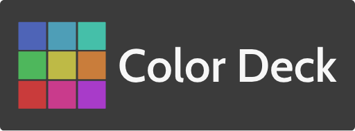

  

# Color Deck
Color Deck is a color palette collector made for humans. Which makes this all about HSL!
Learn more why [HSL is great](https://github.com/imathis/hsl-picker/).

## Table of Contents

1. [Why](#why)
2. [Goals](#goals)
4. [How to use](#how-to-use)
5. [Contributing](#contributing)
6. [License](#license)

## Why
There are quite a few color tools out there. However, none focus on HSL. It is arguably the easiest method for humans to view relationships between colors. Many color tools also arbitrarily decide how many colors should be in a palette or series. I set to fix these issues with Color Deck.

## Goals

- [x] Implement Color wheel picker
- [x] Implement HSL controls
- [x] Offline use - PWA
- [x] Save series of colors
- [x] Click to copy (text) of various color formats
- [ ] Persistent saving (after refresh/close)
- [ ] Implement color groups within palettes

## How to use

[Go here](https://colordeck.netlify.com/) to use the app.

### Installation

For desktop installation this requires [https://www.chromium.org/](https://www.chromium.org/) or [Google Chrome](https://www.google.com/chrome)
1. Visit [Color Deck](https://colordeck.netlify.com/)
2. Click the 3 dot icon to activate the menu and select *Install Color Deck*

For mobile installation (Android)
1. Visit [Color Deck](https://colordeck.netlify.com/) using Google Chrome or Firefox
2. Tap the *Add to Home Screen* message that pops up
3. Launch the Color Deck app icon from the home screen or app drawer

For mobile installation (iOS)
1. Visit [Color Deck](https://colordeck.netlify.com/) using Safari
2. Go to the share menu and tap the *Add to home screen* option
3. Launch the Color Deck app icon from the home screen

**[Back to top](#table-of-contents)**

## Contributing

Open an issue first to discuss potential changes/additions.

**[Back to top](#table-of-contents)**

## License

#### (The MIT License)

Copyright (c) 2019 Jeffrey Summers

Permission is hereby granted, free of charge, to any person obtaining a copy of this software and associated documentation files (the 'Software'), to deal in the Software without restriction, including without limitation the rights to use, copy, modify, merge, publish, distribute, sublicense, and/or sell copies of the Software, and to permit persons to whom the Software is furnished to do so, subject to the following conditions:

The above copyright notice and this permission notice shall be included in all copies or substantial portions of the Software.

THE SOFTWARE IS PROVIDED 'AS IS', WITHOUT WARRANTY OF ANY KIND, EXPRESS OR IMPLIED, INCLUDING BUT NOT LIMITED TO THE WARRANTIES OF MERCHANTABILITY, FITNESS FOR A PARTICULAR PURPOSE AND NONINFRINGEMENT. IN NO EVENT SHALL THE AUTHORS OR COPYRIGHT HOLDERS BE LIABLE FOR ANY CLAIM, DAMAGES OR OTHER LIABILITY, WHETHER IN AN ACTION OF CONTRACT, TORT OR OTHERWISE, ARISING FROM, OUT OF OR IN CONNECTION WITH THE SOFTWARE OR THE USE OR OTHER DEALINGS IN THE SOFTWARE.

**[Back to top](#table-of-contents)**