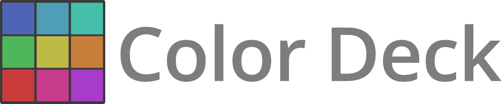
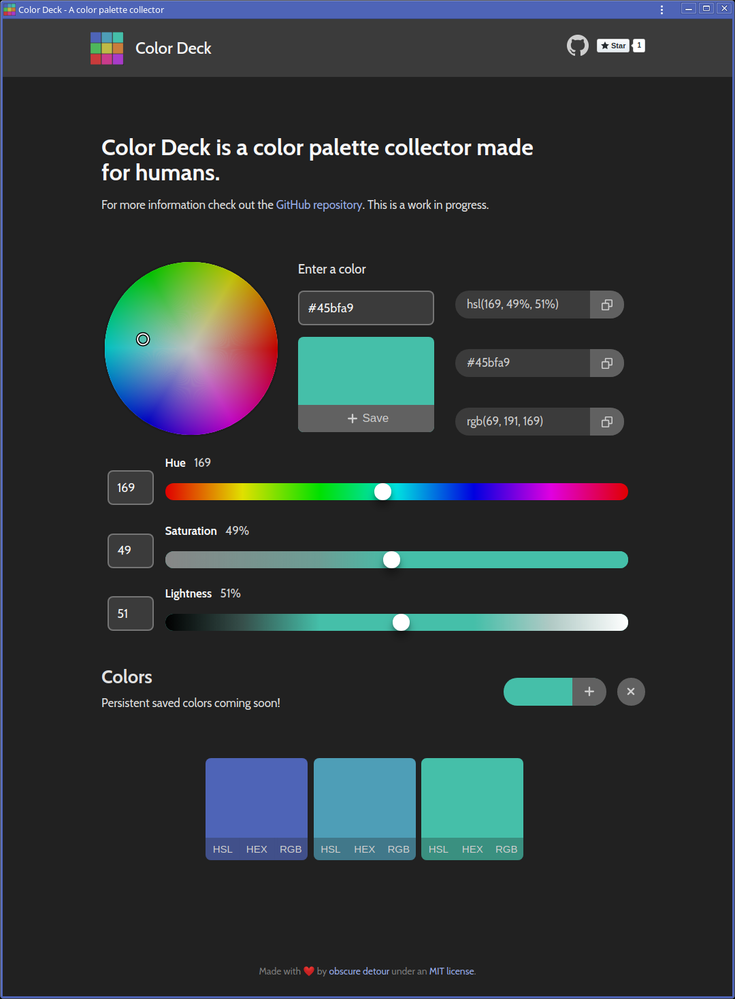

  
   
  
  
  

# Color Deck
Color Deck is a HSL driven color palette collector [progressive web app](https://developers.google.com/web/progressive-web-apps/) made for humans.

There are quite a few color tools out there. However, none focus on HSL. It is arguably the easiest method for humans to view relationships between colors. Many color tools also arbitrarily decide how many colors should be in a palette or series. Color Deck sets out to correct these issues. Learn why [HSL is great](https://github.com/imathis/hsl-picker/).

## Table of Contents

1. [How to use](#how-to-use)
2. [Installation](#installation)
3. [Preview](#Preview)
4. [Contributing](#contributing)
5. [Thanks to others](#thanks-to-others)
6. [Goals](#goals)
7. [License](#license)

## How to use

Go to [color.obscuredetour.com](https://color.obscuredetour.com/) to use the app. For desktop & mobile app installation, see [installation](#installation) below.

**New [Print feature](#print-feature)** Try printing saved colors!

## Installation

**For desktop installation (Windows, Linux, Chrome OS)**
1. Visit [Color Deck](https://color.obscuredetour.com/) using [Chromium](https://www.chromium.org/) or [Google Chrome](https://www.google.com/chrome) - see [this](https://developers.google.com/web/progressive-web-apps/desktop) for version info.
2. Click the 3 dot icon to activate the menu and select *Install Color Deck*

**For mobile installation (Android)**
1. Visit [Color Deck](https://color.obscuredetour.com/) using Google Chrome or Firefox
2. Tap the *Add to Home Screen* message that pops up
3. Launch the Color Deck app icon from the home screen or app drawer

**For mobile installation (iOS)**
1. Visit [Color Deck](https://color.obscuredetour.com/) using Safari
2. Go to the share menu and tap the *Add to home screen* option
3. Launch the Color Deck app icon from the home screen

## Preview

### Print Feature

**[Back to top](#table-of-contents)**

## Contributing

Open an issue first to discuss potential changes/additions.

**[Back to top](#table-of-contents)**

## Thanks to others

Would like to thank [James Daniel](https://github.com/jaames) for his Color Picker [iro.js](https://iro.js.org/). This project would have been a lot more difficult had I not found [iro.js](https://iro.js.org/) and been witness to his great documentation.

[Zen Rocha](https://github.com/zenorocha) for creating [clipboard.js](https://clipboardjs.com/) and making my *'click to copy'* feature so much easier.

[Lea Verou's](http://lea.verou.me/) color tool [contrast-ratio.com](https://contrast-ratio.com) is in use all the time and helped inspire the desire to copy color values in various formats with ease. (So you can paste them in here!)

The guys over at [Refactoring UI](https://refactoringui.com/) deserve a mention for their love of HSL and the Color chapter in their [book](https://refactoringui.com/book/). Funny and informative, but ultimately, it helped foster my distaste for color pickers that allow you to save *just* 5 colors at a time.

**[Back to top](#table-of-contents)**

## Goals

- [x] Implement Color wheel picker
- [x] Implement HSL controls
- [x] Offline use - PWA
- [x] Save series of colors
- [x] Click to copy (text) of various color formats
- [ ] Persistent saving (after refresh/close)
- [ ] Implement color groups within palettes

**[Back to top](#table-of-contents)**

## License

#### (The MIT License)

Copyright (c) 2019 Jeffrey Summers

Permission is hereby granted, free of charge, to any person obtaining a copy of this software and associated documentation files (the 'Software'), to deal in the Software without restriction, including without limitation the rights to use, copy, modify, merge, publish, distribute, sublicense, and/or sell copies of the Software, and to permit persons to whom the Software is furnished to do so, subject to the following conditions:

The above copyright notice and this permission notice shall be included in all copies or substantial portions of the Software.

THE SOFTWARE IS PROVIDED 'AS IS', WITHOUT WARRANTY OF ANY KIND, EXPRESS OR IMPLIED, INCLUDING BUT NOT LIMITED TO THE WARRANTIES OF MERCHANTABILITY, FITNESS FOR A PARTICULAR PURPOSE AND NONINFRINGEMENT. IN NO EVENT SHALL THE AUTHORS OR COPYRIGHT HOLDERS BE LIABLE FOR ANY CLAIM, DAMAGES OR OTHER LIABILITY, WHETHER IN AN ACTION OF CONTRACT, TORT OR OTHERWISE, ARISING FROM, OUT OF OR IN CONNECTION WITH THE SOFTWARE OR THE USE OR OTHER DEALINGS IN THE SOFTWARE.

**[Back to top](#table-of-contents)**
